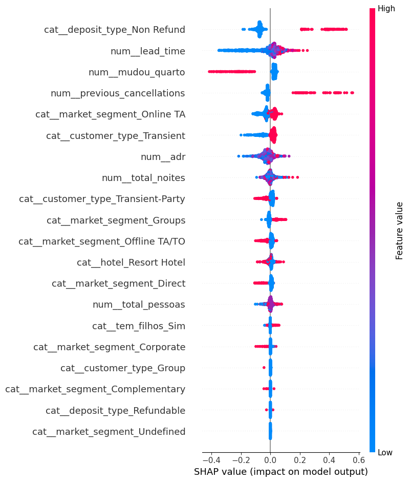

# Hotel Churn

> Solução de machine learning para prever cancelamentos de reservas em hotéis, com API FastAPI, interface Streamlit guiada por linguagem humana e explicabilidade visual com SHAP.

**Autor:** [OYanEnrique](https://github.com/OYanEnrique)

## O problema

Hotéis convivem com uma dor recorrente: a reserva entra no sistema, a ocupação parece garantida, mas o cancelamento pode acontecer antes do check-in. Quando isso ocorre, o impacto é imediato no faturamento, no planejamento da equipe e no uso dos quartos.

Este projeto resolve esse cenário com dados. A proposta é identificar, com antecedência, quais reservas carregam maior risco de cancelamento para permitir ação preventiva antes da perda acontecer.

## Os dados

A base do projeto contém informações operacionais e comportamentais de reservas de hotel. Entre os sinais usados na modelagem estão:

- antecedência da reserva;
- tarifa média diária;
- número de pessoas na reserva;
- quantidade de noites;
- troca de quarto;
- histórico de cancelamentos anteriores;
- tipo de hotel;
- segmento de mercado;
- tipo de depósito;
- tipo de cliente;
- presença de crianças ou bebês.

Esses dados contam a história da reserva antes mesmo do hóspede chegar ao hotel. É essa leitura antecipada que permite transformar risco em decisão.

## Leitura analítica

A exploração dos dados mostrou que o churn de hotel não é aleatório. Ele segue padrões bem definidos de perfil e contexto.

O trabalho foi conduzido com base em duas perguntas centrais:

1. quais sinais antecedem um cancelamento?
2. qual modelo consegue capturar melhor esses cancelamentos sem perder cobertura?

### Hipóteses que guiaram a análise

- Hipótese nula: o tipo de cliente não influencia a taxa de cancelamento.
- Hipótese alternativa: o tipo de cliente influencia a taxa de cancelamento.
	- Resultado: hipótese alternativa venceu — há evidência estatística de diferença (rejeitamos a hipótese nula).

- Hipótese nula: reservas com crianças ou bebês não se comportam de forma diferente em relação ao cancelamento.
- Hipótese alternativa: reservas com crianças ou bebês se comportam de forma diferente.
	- Resultado: hipótese alternativa venceu — há evidência estatística de diferença (rejeitamos a hipótese nula).

- Hipótese nula: o mês de chegada não altera a taxa de cancelamento.
- Hipótese alternativa: o mês de chegada altera a taxa de cancelamento.
	- Resultado: hipótese alternativa venceu — há evidência estatística de diferença por mês (rejeitamos a hipótese nula).

Essas hipóteses ajudaram a organizar a investigação e a encontrar sinais úteis para o negócio.

Para testar cada hipótese utilizamos o teste qui-quadrado (chi-square) em tabelas de contingência, com nível de significância de **5%**. A decisão sobre rejeitar ou não a hipótese nula segue esse critério.

### Padrões mais relevantes

Ao longo da análise, alguns fatores apareceram com bastante força:

- reservas feitas com maior antecedência tendem a apresentar maior risco;
- histórico de cancelamentos anteriores aumenta a chance de novo cancelamento;
- depósitos não reembolsáveis aparecem como um sinal importante;
- a troca de quarto pode reduzir o risco de churn;
- o perfil do cliente e o canal de reserva ajudam a explicar o comportamento.

Na leitura do notebook, esse comportamento ficou ainda mais claro quando a troca de quarto foi interpretada como possível upgrade: o encantamento do cliente se mostrou um mecanismo capaz de reduzir cancelamentos.

### Leitura e preparação inicial

A preparação do conjunto final foi feita com **11 variáveis**: **6 numéricas** e **5 categóricas**. O alvo era `is_canceled`.

### Pipeline de pré-processamento

O pré-processamento foi encapsulado em um pipeline aplicado antes do ajuste do modelo. As etapas principais foram:

- **StandardScaler** (variáveis numéricas): padroniza as variáveis numéricas para média zero e desvio padrão 1. Isso evita que features com escala maior dominem o processo de aprendizado, melhora a estabilidade e convergência de muitos algoritmos e torna coeficientes e distâncias comparáveis.

- **OneHotEncoder** (variáveis categóricas): converte categorias em vetores binários (one-hot). Essa transformação preserva informação categórica sem impor ordenação numérica e permite que modelos lineares e baseados em árvores tratem categorias de forma explícita.

As transformações são aplicadas por coluna (por exemplo via `ColumnTransformer`) com `col_num` submetido ao `StandardScaler` e `col_cat` ao `OneHotEncoder`. O `preprocessor` final foi treinado apenas no conjunto de treino e persistido em `models/preprocessor.joblib` para uso pela API e pela interface Streamlit.

Essa etapa de pré-processamento é executada sempre antes da predição — tanto no pipeline de treinamento quanto no endpoint de inferência (`POST /prever_churn`) — garantindo que os dados enviados para o modelo sigam a mesma escala e codificação usados em treino.

O recorte principal foi este:

```python
X = df_clean[['lead_time', 'adr', 'total_pessoas', 'total_noites', 'mudou_quarto', 'previous_cancellations', 'hotel', 'market_segment', 'deposit_type', 'customer_type', 'tem_filhos']]
y = df_clean['is_canceled']
```

```python
col_num = ['lead_time', 'adr', 'total_pessoas', 'total_noites', 'mudou_quarto', 'previous_cancellations']
col_cat = ['hotel', 'market_segment', 'deposit_type', 'customer_type', 'tem_filhos']
```

Essas variáveis foram escolhidas porque condensam o comportamento comercial e operacional da reserva antes do check-in.

Fonte dos dados: [Kaggle - Hotel Booking Demand](https://www.kaggle.com/datasets/jessemostipak/hotel-booking-demand)
## Resultado de modelagem

O modelo final foi escolhido para priorizar o **recall** da classe de cancelamento. Em outras palavras, a meta foi capturar o maior número possível de cancelamentos reais.

Isso faz sentido para o problema de negócio: é melhor detectar cedo a maioria dos hóspedes que vão cancelar do que deixá-los escapar sem reação.

Na prática, isso ajuda o hotel a:

- reavaliar overbooking;
- ajustar a alocação de quartos;
- preparar ações de retenção;
- proteger receita e ocupação.

### Comparação entre modelos

O notebook comparou ao menos duas abordagens principais:

- **Logistic Regression** como baseline interpretável;
- **Random Forest** como modelo mais forte para captar padrões não lineares.

Os resultados mais importantes foram:

- **Logistic Regression**: recall de **45%**. Em termos práticos, de cada 100 clientes que realmente iam cancelar, o modelo detectava 45 e deixava 55 passarem.
- **Random Forest inicial**: recall de **72%** e precisão de **79%**.
- **Random Forest melhorado**: recall de **77%** e precisão de **74%**.

O ajuste de hiperparâmetros foi feito com **RandomizedSearchCV**, porque o objetivo era explorar combinações de parâmetros com foco em recall, sem limitar a busca a uma grade fixa devido ao custo computacional.

O motivo da escolha do **Random Forest** em vez da **Logistic Regression** foi direto: o problema de churn precisa de maior cobertura dos cancelamentos reais. A regressão logística entregou apenas **45% de recall**, enquanto a floresta aleatória chegou a **72%** e depois a **77%**, o que representa uma diferença operacional muito relevante.

Em termos de negócio, o impacto foi descrito assim no notebook:

- o primeiro modelo ainda deixava escapar **28%** dos canceladores;
- o segundo modelo reduziu essa perda para **23%**;
- o ganho veio ao custo de uma queda de precisão de **79%** para **74%**, que foi aceita porque o foco era prevenir cancelamentos, não apenas evitar alarmes falsos.

### Por que o Random Forest venceu

O ponto de decisão foi simples: para churn, o custo de deixar um cancelador passar é maior do que o custo de gerar alguns falsos alarmes.

- A **Logistic Regression** foi útil como baseline, mas ficou em **45% de recall**.
- O **Random Forest inicial** avançou para **72% de recall** com **79% de precisão**.
- O **Random Forest melhorado** chegou a **77% de recall** com **74% de precisão**.

Ou seja: a floresta aleatória ganhou porque entregou mais cobertura sobre os canceladores reais, que é exatamente o que o problema pedia.

### Explicabilidade com SHAP

O gráfico abaixo foi gerado a partir do modelo final com `TreeExplainer` e resume, de forma objetiva, como cada variável empurra a previsão para cima ou para baixo.



O foco da leitura foi entender quais sinais mais contribuem para o cancelamento e como eles se combinam na previsão.

Além de prever, a solução mostra **por que** o risco sobe ou desce. Isso aumenta a confiança no modelo e facilita a conversa com o time de negócio.

## Conclusão do projeto

Hotéis enfrentam cancelamentos de última hora que geram quartos vazios, perda de receita e desorganização operacional. O objetivo central deste projeto foi criar uma inteligência capaz de antecipar quais reservas correm risco real de cancelamento.

A solução construída usa um **Random Forest (Floresta Aleatória)** otimizado para maximizar a captura de cancelamentos. Na prática, isso significa que o hotel ganha tempo para agir antes da perda acontecer.

A conclusão quantitativa é importante: o modelo final alcançou **77% de recall**, com **74% de precisão**. Isso quer dizer que ele acertou a maioria dos canceladores reais e ainda manteve um nível aceitável de alarmes falsos para o cenário de negócio.

A explicabilidade com **SHAP** mostrou um padrão muito valioso: a troca de quarto aparece como um fator de destaque, indicando que o encantamento do cliente pode reduzir significativamente a chance de churn. O projeto também reforça que reservas com maior antecedência, histórico de cancelamentos e características ligadas ao depósito e ao perfil do cliente influenciam fortemente o risco.

Em resumo, o churn de hotel não deve ser tratado como surpresa operacional. Quando o negócio entende o padrão por trás do cancelamento, ele passa a agir antes da perda acontecer. Essa solução junta previsão, explicação e usabilidade para transformar dados em decisão.

## Como a solução funciona

### Modelo no Google Drive

O `modelo.joblib` é carregado diretamente do Google Drive em memória pela API (sem download local do arquivo para disco).

Pasta do modelo no Drive:

https://drive.google.com/drive/folders/1kfIFATtqms9L4TUac_0QpdWbED4gm3b1

### API

O arquivo [app/api.py](app/api.py) expõe o endpoint:

`POST /prever_churn`

A API recebe os dados da reserva, aplica o `preprocessor` e usa o `modelo` para gerar a previsão.

### Como a API trabalha

O endpoint `POST /prever_churn` recebe a reserva em formato estruturado, converte os dados em `DataFrame`, aplica o `preprocessor` e retorna a classe prevista pelo modelo.

### Streamlit

O arquivo [app/streamlit_app.py](app/streamlit_app.py) coleta os dados do usuário com perguntas humanas, sem exibir nomes técnicos como `lead_time` ou `previous_cancellations`.

### Como a interface conversa com a API

O Streamlit pergunta os dados em linguagem humana, transforma as respostas no payload esperado pela API e envia tudo para o endpoint de predição.

Esse desenho evita expor nomes técnicos ao usuário e mantém a experiência mais clara e profissional.

## Estrutura organizada

O projeto foi reorganizado em pastas para separar responsabilidades e evitar arquivos soltos na raiz:

```text
hotel-churn/
├── app/
│   ├── __init__.py
│   ├── api.py
│   └── streamlit_app.py
├── assets/
│   └── shap1000.png
├── data/
│   └── hotel_bookings.csv
├── models/
│   └── preprocessor.joblib
├── notebooks/
│   └── churn_hotel.ipynb
├── Dockerfile
├── README.md
├── requirements.txt
└── .dockerignore
```

Na raiz ficam apenas os arquivos de entrada do projeto: documentação, dependências e configuração de build.

## Requisitos

- Python 3.10+
- `pip`
- Opcional: Docker

## Instalação local

```bash
pip install -r requirements.txt
```

## Como executar

### 1. Suba a API

```bash
uvicorn app.api:app --host 0.0.0.0 --port 8000
```

### 2. Suba o Streamlit

Em outro terminal:

```bash
streamlit run app/streamlit_app.py
```

Se necessário, ajuste a variável de ambiente `API_URL` para apontar para outro endereço da API.

### 3. Com Docker

```bash
docker build -t hotel-churn .
docker run --rm -p 8000:8000 -p 8501:8501 -v "$(pwd)":/app hotel-churn
```

## Próximos passos possíveis

- publicar uma versão em nuvem;
- separar API e UI em containers distintos;
- incluir métricas do modelo em uma seção própria;

## Licença

Uso acadêmico e demonstrativo.

---

Desenvolvido por [OYanEnrique](https://github.com/OYanEnrique).
